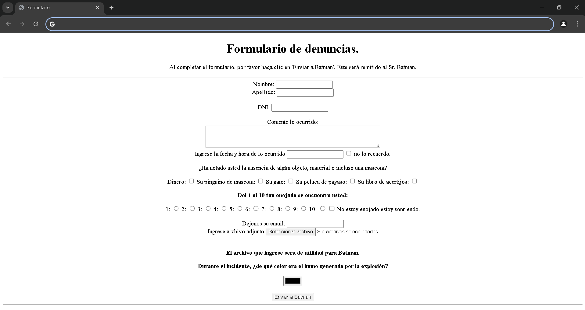

# Practica `input`.

2. Realice un documento `HTML`, en base a la siguiente imagen:

Las etiquetas utilizadas son las siguientes: `center`, `form`, `header`, `article`, `p`, `input:text`, `input:number`, `input:datetime-local`, `input:radio`, `input:checkbox`, `input:color`, `input:file`, `input:email` y `input:submit`.
 

## Video ilustrativo.

